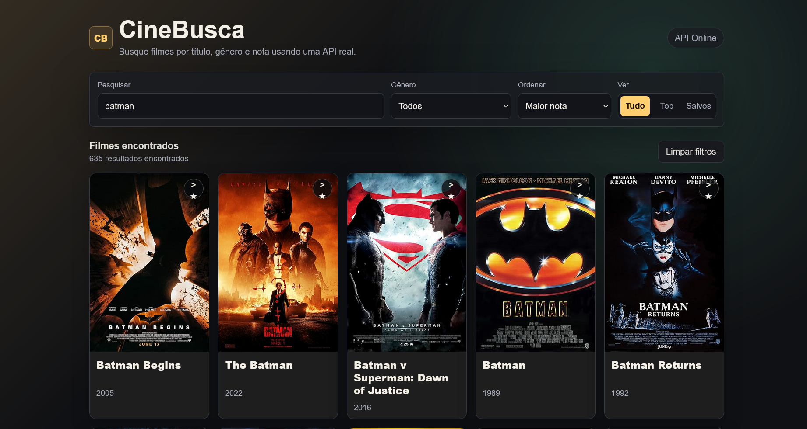

# 🎬 CineBusca

Aplicação web para busca de filmes utilizando a API pública do OMDb.

O projeto permite pesquisar filmes em tempo real, visualizar detalhes completos em modal, salvar favoritos no navegador e navegar entre páginas de resultados.

---

## 🚀 Funcionalidades

- 🔎 Busca de filmes por nome
- ⭐ Sistema de favoritos com LocalStorage
- 🎬 Modal com detalhes completos do filme
- 📄 Paginação de resultados
- 🔃 Ordenação por título e ano
- 🎭 Filtro por tipo (filme, série, game)
- 📱 Layout responsivo
- 🌙 Interface moderna em dark mode
- ⚠️ Tratamento de erros e loading states

---

## 🛠️ Tecnologias utilizadas

- HTML5
- CSS3
- JavaScript Vanilla
- OMDb API

---

## 📷 Preview



---

## 🌐 API utilizada

OMDb API:

https://www.omdbapi.com/

---

## 📚 Aprendizados

Durante o desenvolvimento deste projeto pratiquei:

- Consumo de APIs REST
- Manipulação de DOM
- Async/Await
- Eventos
- Responsividade
- Organização de código
- Paginação
- LocalStorage
- Renderização dinâmica de elementos

---

## ▶️ Como executar

Clone o repositório:

```bash
git clone https://github.com/LupinCA/cinebusca.git
```

Abra o arquivo:

```bash
index.html
```

---

## 📌 Melhorias futuras

- Melhor filtro de gêneros reais
- Skeleton loading
- Infinite scroll
- Versão em React
- Animações mais avançadas

---

## 👩‍💻 Desenvolvido por

Luisa Araujo
